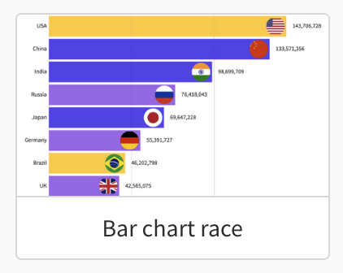

This script is meant to easily visualise data coming from the Capital Karts email race results with Flourish.

## How?

1. Select data in the Capital Karts email like the following image 
2. Paste it in Excel and export the file as csv 
3. The output file of `python main.py <DATA_FILENAME>` can be then uploaded in Flourish 